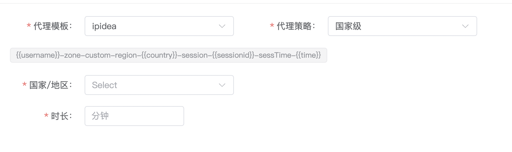
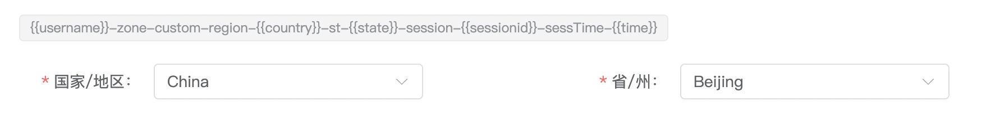
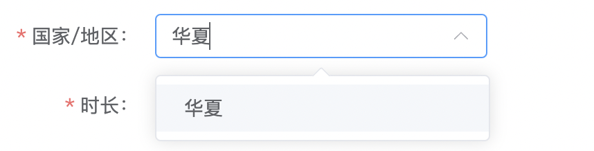

::: warning
注意：在PC端中操作系统取决于你本地真实的操作系统，并不是无法模拟，而是没有任何意义！！
如果你是Windows操作系统，你所创建的浏览器内核以及各项配置均以Windows特性创建。
反之苹果(Mac系统)，亦然～～
:::

## 创建浏览器

> 创建浏览器非常简单，没有太多复杂的配置和选项。surveybrowser会根据算法进行优化配置项。

> 接下来说一下关于代理配置的机制

- 代理模板
    如果你没有设置代理模板，可以通过常规的方式进行配置代理。如：http、socks5等

    强烈建议使用代理模板的形式，这样做可以省去大量的时间去配置。

> 注意看这里，{{username}}-zone-custom-region-{{country}}-session-{{sessionid}}-sessTime-{{time}}
> 如果你的策略中只有国家 {{country}} ,那么在选择框中只会出现国家/地区

> 如果你的策略中存在 {{state}} ,在选择完国家/地区时，接下来就会显示省/州。如下图：

::: warning
请注意：国家/地区、省/州、城市等选择框，不需要完全依赖下拉框中的数据，你完全可以自定义任何内容。如下图所示：
:::

当你输入结束，直接按下回车键即可