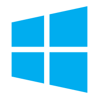

  

    
    <h2>Windows (64bit)</h2>
    
Windows 10, 11

    <a href="https://publisher.surveybrowser.com/download/latest/windows_64" class="download-button">下载</a>
  

  

    
    <h2>Windows (32bit)</h2>
    
Windows 10, 11

    <a href="https://publisher.surveybrowser.com/download/latest/windows_32" class="download-button">下载</a>
  

  

    
    <h2>macOS (arm64)</h2>
    
Mac系统M系列芯片

    <a href="https://publisher.surveybrowser.com/download/latest/osx_arm64" class="download-button">下载</a>
  

    

    
    <h2>macOS (x64)</h2>
    
Intel芯片系列

    <a href="https://publisher.surveybrowser.com/download/latest/osx_64" class="download-button">下载</a>
  

