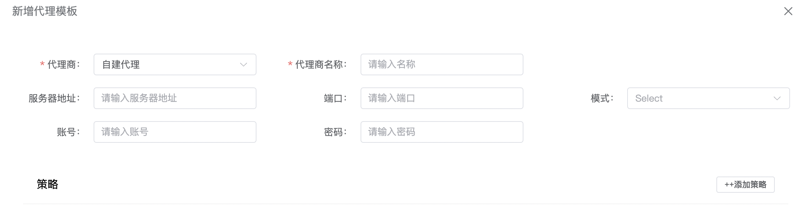
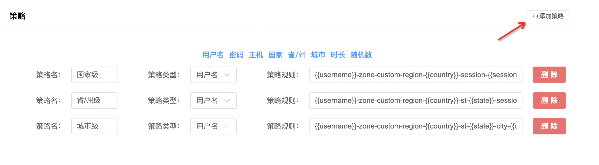

## 什么是代理模板？
> Surveybrowser的代理模板作用主要体现在快速创建配置，一键启用。
> 同时在定义好规则与策略时软件会全自动的刷新和变配。
> 在同类产品的一般用于自动化配置都是由软件内置的几个代理服务商，而surveybrowser打破这个限定。任何代理服务商均可集成在软件中使用

一般市场的HTTP代理服务商的设置分为 **旋转模式**和**会话会话**
###### 旋转模式
通常用于蜘蛛抓虫的应用场景，即每一次请求都会自动更换ip地址

###### 会话模式
一般用于需要保持固定ip的应用场景中，当需要更ip时需要修改特定的会话字符串

## 创建模板

- 代理商

    选择自建代理，即可配置你所使用代理商的相关信息

- 代理商名称

    命名随意，允许重复，只是为了当你创建多个代理商模板时用于区分。仅此而已

- 服务器地址

    代理商会提供服务器地址，有的提供ip，有的提供域名。不同的代理服务商是不一样的。

    > 以ipidea代理商为例，它提供的服务器地址为：proxy.ipidea.io
    > 因此你只需要将 “proxy.ipidea.io” 复制进输入框即可

- 端口

    即然有服务器地址，必不可少的是端口号，一般都会提供端口号。如没有端口号可留空

    > 以 Ipidea为例，端口号为：2333

- 模式

    模式分为2种，http和socks5

    具体你的代理服务商是什么代理模式，可咨询代理服务商

    > 以ipidea为例，一般使用http

- 账号
    
    由代理服务商提供，可为空

- 密码
  
    由代理服务商提供，可为空

## 添加策略

> 策略是整体代理模板的核心，如下图：

> 你可以添加多个不同的策略

- 策略名

    随意，只为了区分

- 策略类型

    一般代理服务商会提供一些特殊配置方式。比如：指定国家、省/州、城市、过期时间、会话ID等。而这些设置的地方不同的服务商规定的不同，有的需要放在用户名里面，有的需要放在密码内，也有的需要放在服务器地址块内。

    因此你需要知道你所使用的代理服务商，它是什么样的配置模式。

    > 同样以ipidea为例，它的这些配置是放在用户名里面的，因此这里就选择：用户名

- 策略规则

    在这一块相对复杂一些，我将会举一些例子。

    > 以ipidea为例，从他们的官方可以看到要求的格式是：
    [account]-zone-custom-region-kr-session-b5b36885cad-sessTime-20

    其中[account] 指的是用户名，我们将这一串删除，在规则内我们只需要点击
    
    让它替换成软件的规则。

    其中kr指定的是国家的缩写，同样的，将kr删除，点击页面中蓝色部分的国家。

    b5b36885cad 是会话ID，将它删除，替换成随机数

    20 指的是会话时长，因此将它替换成：时长

    > 最终替换的结果是：{{username}}-zone-custom-region-{{country}}-session-{{sessionid}}-sessTime-{{time}}